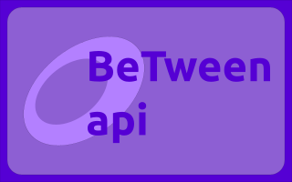

Welcome to the BeTween Api documentation!
=========================================

.. _minetest: https://www.minetest.net/

<<<<<<< HEAD
**BeTweenApi** is a lua library for the `minetest`_ game engine that implement math and easing functions to create smooth animations.
=======
**BeTweenApi** is a lua library for the `minetest`_ that implement math and easing functions used to create smooth animations.

It include a Tween object to setup animations for a period of time and debug features such as commands.

>>>>>>> 6764d96dd732f700025594b0e4594dad9e22125f

Contents
--------

<<<<<<< HEAD
Everything of BeTween Api is defined inside the namespace `BeTweenApi <./api.html>`_ .
=======
Everything of BeTween Api is defined inside the namespace `BeTweenApi <./namespace.html>`_ .
>>>>>>> 6764d96dd732f700025594b0e4594dad9e22125f

.. toctree::

	commands
	api
<<<<<<< HEAD
=======
	interpolations
	Tween
>>>>>>> 6764d96dd732f700025594b0e4594dad9e22125f

Previews
--------

.. raw:: html

    <iframe width="640" height="480" src="https://www.youtube.com/watch?v=FzuNvx5aFR8" frameborder="0" allowfullscreen></iframe>
