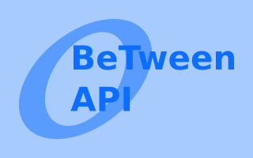
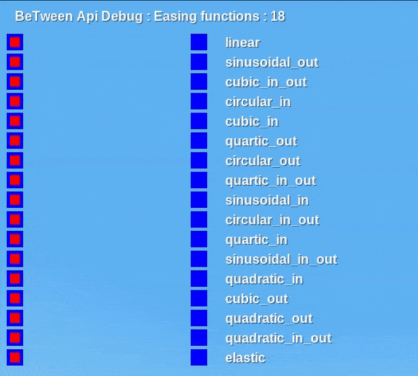

	

# BeTween Api

This is a mod that implements interpolation functions and tween for animation in the game [minetest](https://www.minetest.net/).

This mod can be used by other mods for animations, currently tested for huds.

## Installation

Just put this mod in your mod folder or in your custom mod.

## Wiki

Documentation about using the features of the api is written in the [docs](/docs) folder.

# Media source

Media I made for this api is published on google drive [here](https://drive.google.com/drive/folders/1kp2ljRgsPWEx1zjvCLJ-GepSpDH2Cqzf?usp=sharing) .

## Contribute

If you want to add more easing functions or want to ask about a specific feature, ask in the [Issues](https://github.com/GianptDev/between-api-minetest/issues) panel.

See also [CONTRIBUTING.md](/CONTRIBUTING.md)

# preview

