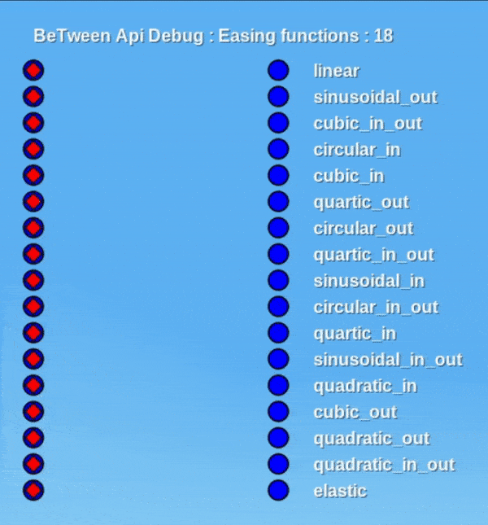

	

# BeTween Api

This is a mod that implements interpolation functions and tween for animation in the game [minetest](https://www.minetest.net/).

## Installation

Just put this mod in your mod folder and add the dependency in you game/mod.

## Wiki

See the [docs](https://between-api-minetest.readthedocs.io/en/stable/).

## Contribute

See [CONTRIBUTING.md](/CONTRIBUTING.md).

# preview

